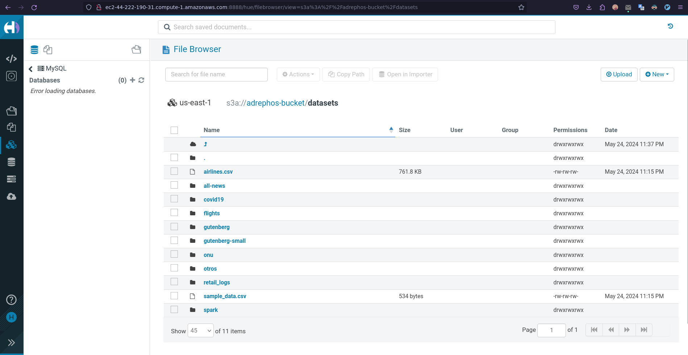

# ST0256 Tópicos Especiales en Telemática

## Estudiante:
- Nombre: Juan Esteban Avendaño Castaño
- Correo: jeavendanc@eafit.edu.co

## Profesor:
- Nombre: Álvaro Ospina
- Correo: aeospinas@eafit.edu.co

# Reto 5 -  HDFS y S3

## Cluster de Amazon EMR
Este es el cluster de Amazon EMR que se utilizó para el desarrollo del reto 5. El cluster fue creado con las indicaciones del
[Lab 0](https://github.com/st0263eafit/st0263-241/blob/main/bigdata/00-lab-aws-emr/Install-AWS-EMR.pdf):


## Gestión de archivos en HDFS y S3

### 1. Clonar el repositorio
Primero clono el repositorio de manera local en mi computador personal e ingreso a la carpeta del reto 5:
```bash
git clone git@github.com:st0263eafit/st0263-241.git
cd st0263-241/bigdata/datasets/
```

### 2. Subir archivos al cluster
Para subir los archivos al cluster uso scp y me conecto al cluster de Amazon EMR:


Así se ven los archivos en el cluster:


### 3. Copiar archivos a HDFS
Para copiar los archivos a HDFS uso el comando `hdfs dfs -copyFromLocal` de la siguiente manera:


Tambien podemos verificar la existencia de los archivos usando HUE:


### 4. Copiar archivos a S3
Para copiar los archivos a S3 uso el comando `hadoop distcp` de la siguiente manera:


Así se ven los archivos en S3:


Y así se ven los archivos en el bucket de S3 desde HUE:


## Conclusiones
- Se logró subir archivos al cluster de Amazon EMR y copiarlos a HDFS y S3.
- Se verificó la existencia de los archivos en HDFS y S3.
- Se logró visualizar los archivos en HDFS y S3 desde HUE.
